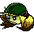

Welcome!

The project here, Rap-It-Up, is still in progress. However, for those who'd like to read further, you may.

---

This game is a **soon to be** playable rhythm game made in HaxeFlixel, inspired by the likes of [Friday Night Funkin'](https://www.newgrounds.com/portal/view/770371) and [Parappa The Rapper](https://www.playstation.com/en-us/games/parappa-the-rapper-remastered/).

Still in progress, expect some messy or incomplete code. Placeholder graphics also used.

---

Installing this requires compiling it from the source code, because as of writing, there is no proper release.

Check out [Compiling.md](Documentation/Compiling.md).

---

Special Thanks:

- To everyone.